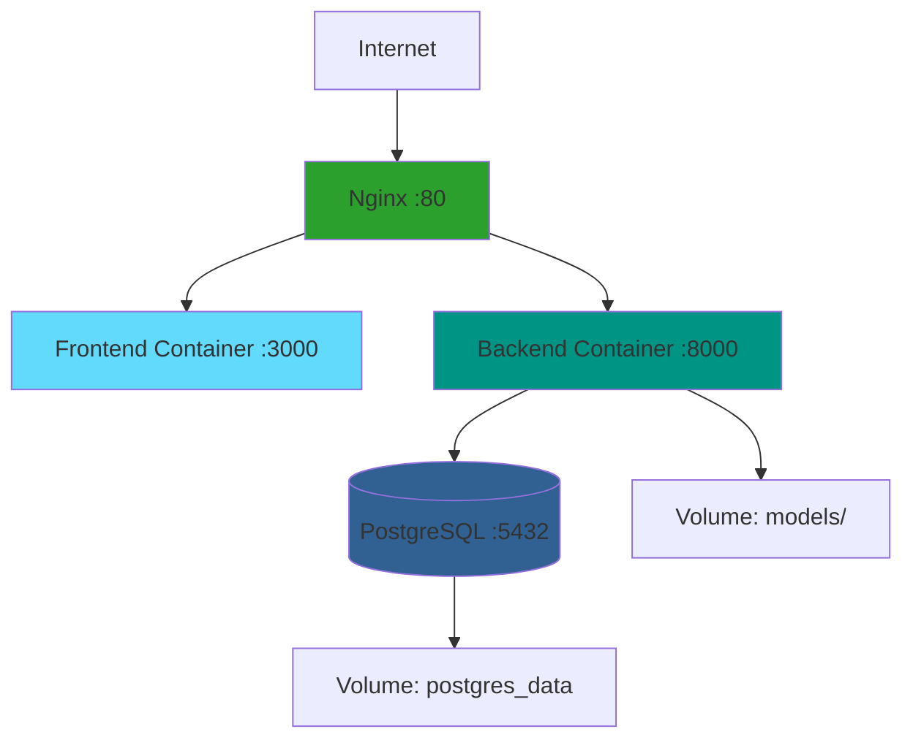

# Guía de Despliegue con Docker

Esta guía explica cómo desplegar Escudo Escolar usando Docker y Docker Compose.

## Requisitos

- Docker 20.10+
- Docker Compose 2.0+

### Instalación de Docker

#### Linux (Ubuntu/Debian)
```bash
# Instalar Docker
curl -fsSL https://get.docker.com -o get-docker.sh
sudo sh get-docker.sh

# Instalar Docker Compose
sudo apt-get update
sudo apt-get install docker-compose-plugin

# Añadir usuario al grupo docker
sudo usermod -aG docker $USER
newgrp docker
```

#### macOS
```bash
# Instalar Docker Desktop
brew install --cask docker
```

#### Windows
Descargar e instalar [Docker Desktop](https://www.docker.com/products/docker-desktop/)

## Configuración

### 1. Copiar archivo de variables de entorno

```bash
cp .env.docker .env
```

### 2. Editar `.env` con tus valores

```env
# Base de datos
POSTGRES_DB=escudo_escolar_db
POSTGRES_USER=backend_app
POSTGRES_PASSWORD=tu_password_seguro_aqui

# Backend
SECRET_KEY=tu_clave_secreta_jwt_aqui
OPENAI_API_KEY=tu_openai_api_key_aqui
MODEL_PATH=/app/models/bullying_detection_model.json
ALLOWED_ORIGINS=http://localhost:3000,http://localhost
DEBUG=False

# Frontend
NEXT_PUBLIC_API_URL=http://localhost:8000
```

### 3. Generar SECRET_KEY segura

```bash
# Opción 1: Python
python3 -c "import secrets; print(secrets.token_urlsafe(32))"

# Opción 2: OpenSSL
openssl rand -hex 32
```

### 4. Copiar modelo ML

```bash
# Asegúrate de que el modelo esté en la carpeta models/
cp /ruta/al/modelo/bullying_detection_model.json ./models/
```

## Despliegue

### Modo Desarrollo (sin Nginx)

```bash
# Construir y levantar todos los servicios
docker-compose up -d

# Ver logs
docker-compose logs -f

# Ver logs de un servicio específico
docker-compose logs -f backend
docker-compose logs -f frontend
docker-compose logs -f db
```

### Modo Producción (con Nginx)

```bash
# Levantar con perfil de producción
docker-compose --profile production up -d
```

### Acceder a la aplicación

- **Frontend**: http://localhost:3000
- **Backend API**: http://localhost:8000
- **Swagger Docs**: http://localhost:8000/docs
- **Con Nginx**: http://localhost

## Comandos Útiles

### Ver estado de los servicios

```bash
docker-compose ps
```

### Detener servicios

```bash
docker-compose stop
```

### Detener y eliminar servicios

```bash
docker-compose down
```

### Detener y eliminar todo (incluye volúmenes)

```bash
docker-compose down -v
```

### Reiniciar un servicio específico

```bash
docker-compose restart backend
docker-compose restart frontend
```

### Ver logs en tiempo real

```bash
docker-compose logs -f
```

### Ejecutar comandos dentro de un contenedor

```bash
# Backend
docker-compose exec backend bash

# Frontend
docker-compose exec frontend sh

# PostgreSQL
docker-compose exec db psql -U backend_app -d escudo_escolar_db
```

### Reconstruir imagen después de cambios

```bash
# Reconstruir backend
docker-compose build backend

# Reconstruir frontend
docker-compose build frontend

# Reconstruir todo
docker-compose build

# Reconstruir sin caché
docker-compose build --no-cache
```

## Inicialización de Base de Datos

### Opción 1: Scripts SQL automáticos

Los scripts en `data/database/` se ejecutan automáticamente al crear el contenedor de PostgreSQL:

```bash
data/database/
├── 01_create_database.sql
├── 02_create_user.sql
└── 03_insert_demo_data.sql
```

### Opción 2: Ejecutar scripts manualmente

```bash
# Copiar scripts al contenedor
docker cp data/database/01_create_database.sql escudo-db:/tmp/

# Ejecutar script
docker-compose exec db psql -U backend_app -d escudo_escolar_db -f /tmp/01_create_database.sql
```

### Opción 3: Crear usuarios de prueba con Python

```bash
docker-compose exec backend uv run python create_test_users.py
```

## Backup de Base de Datos

### Crear backup

```bash
# Backup completo
docker-compose exec db pg_dump -U backend_app escudo_escolar_db > backup_$(date +%Y%m%d_%H%M%S).sql

# Backup comprimido
docker-compose exec db pg_dump -U backend_app escudo_escolar_db | gzip > backup_$(date +%Y%m%d_%H%M%S).sql.gz
```

### Restaurar backup

```bash
# Desde archivo SQL
docker-compose exec -T db psql -U backend_app escudo_escolar_db < backup.sql

# Desde archivo comprimido
gunzip -c backup.sql.gz | docker-compose exec -T db psql -U backend_app escudo_escolar_db
```

## Actualización de la Aplicación

```bash
# 1. Obtener cambios del código
git pull

# 2. Reconstruir imágenes
docker-compose build

# 3. Recrear contenedores
docker-compose up -d

# 4. Ver logs para verificar
docker-compose logs -f
```

## Troubleshooting

### El contenedor no inicia

```bash
# Ver logs detallados
docker-compose logs backend
docker-compose logs frontend

# Verificar configuración
docker-compose config
```

### Error de conexión a base de datos

```bash
# Verificar que PostgreSQL esté corriendo
docker-compose ps db

# Verificar health check
docker inspect escudo-db | grep -A 10 Health

# Reiniciar base de datos
docker-compose restart db
```

### Puerto ya en uso

```bash
# Cambiar puertos en docker-compose.yml
# Por ejemplo, para backend:
ports:
  - "8001:8000"  # Mapear puerto 8001 del host al 8000 del contenedor
```

### Problemas de permisos

```bash
# Dar permisos a carpetas montadas
sudo chown -R $USER:$USER ./models
sudo chown -R $USER:$USER ./backend/logs
```

### Limpiar sistema Docker

```bash
# Eliminar contenedores detenidos
docker container prune

# Eliminar imágenes sin usar
docker image prune

# Eliminar volúmenes sin usar
docker volume prune

# Limpieza completa
docker system prune -a --volumes
```

## Variables de Entorno Importantes

| Variable | Descripción | Valor por defecto |
|----------|-------------|-------------------|
| `POSTGRES_DB` | Nombre de la base de datos | `escudo_escolar_db` |
| `POSTGRES_USER` | Usuario de PostgreSQL | `backend_app` |
| `POSTGRES_PASSWORD` | Contraseña de PostgreSQL | **Requerido** |
| `SECRET_KEY` | Clave para JWT | **Requerido** |
| `OPENAI_API_KEY` | API Key de OpenAI | Opcional |
| `MODEL_PATH` | Ruta al modelo ML | `/app/models/...` |
| `NEXT_PUBLIC_API_URL` | URL del backend | `http://localhost:8000` |
| `DEBUG` | Modo debug | `False` |

## Monitoreo

### Uso de recursos

```bash
# Ver uso de CPU y memoria
docker stats

# Ver uso de disco
docker system df
```

### Health checks

```bash
# Backend
curl http://localhost:8000/api/health

# Frontend
curl http://localhost:3000

# Base de datos
docker-compose exec db pg_isready -U backend_app
```

## Producción

### Configuración recomendada para producción

1. **Cambiar contraseñas por defecto**
2. **Generar SECRET_KEY único y seguro**
3. **Configurar ALLOWED_ORIGINS con tu dominio**
4. **Usar volúmenes nombrados para datos persistentes**
5. **Configurar backup automático de base de datos**
6. **Usar Nginx con SSL (certbot)**
7. **Configurar límites de recursos**:

```yaml
services:
  backend:
    deploy:
      resources:
        limits:
          cpus: '1'
          memory: 1G
        reservations:
          cpus: '0.5'
          memory: 512M
```

### SSL con Let's Encrypt

```bash
# Instalar certbot en el host
sudo apt-get install certbot python3-certbot-nginx

# Obtener certificado
sudo certbot --nginx -d tu-dominio.com

# Copiar certificados a nginx/ssl/
sudo cp /etc/letsencrypt/live/tu-dominio.com/fullchain.pem nginx/ssl/
sudo cp /etc/letsencrypt/live/tu-dominio.com/privkey.pem nginx/ssl/
```

## Arquitectura Docker



## Soporte

Para más información:
- [Documentación de Docker](https://docs.docker.com/)
- [Documentación de Docker Compose](https://docs.docker.com/compose/)
- [README principal](README.md)
