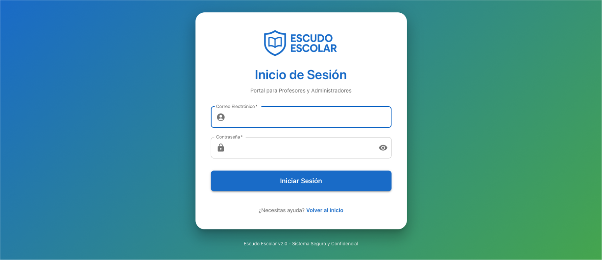
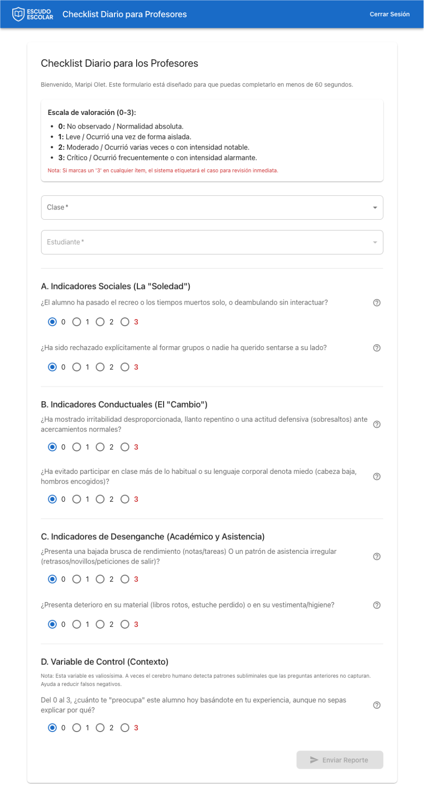
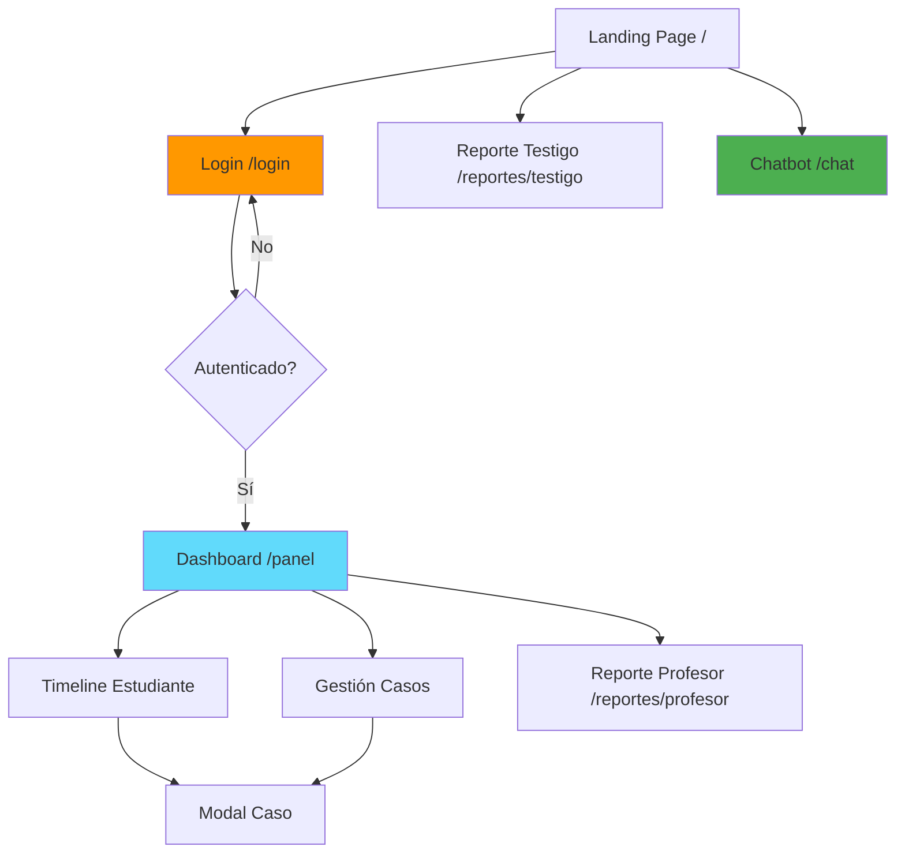

# Escudo Escolar - Frontend

<p align='left'>
    <a href="https://react.dev/"></a>
    <a href="https://nextjs.org/"></a>
    <a href="https://mui.com/"></a>
    <a href="https://en.wikipedia.org/wiki/JavaScript"></a>
    <a href="https://www.w3.org/Style/CSS/Overview.en.html"></a>
    <a href="https://en.wikipedia.org/wiki/HTML"></a>
</p>

Aplicación web para el sistema de detección temprana de bullying escolar con inteligencia artificial.

## Tabla de Contenidos

- [Descripción](#descripción)
- [Características](#características)
- [Tecnologías](#tecnologías)
- [Estructura del Proyecto](#estructura-del-proyecto)
- [Instalación](#instalación)
- [Configuración](#configuración)
- [Ejecución](#ejecución)
- [Páginas y Componentes](#páginas-y-componentes)
- [Flujo de Navegación](#flujo-de-navegación)
- [API Client](#api-client)
- [Desarrollo](#desarrollo)
- [Build y Deploy](#build-y-deploy)
- [Licencia](#licencia)

## Descripción

El frontend de Escudo Escolar es una aplicación web construida con Next.js que proporciona interfaces intuitivas para:

- Profesores: Dashboard interactivo con heatmap, timeline y gestión de casos
- Estudiantes/Testigos: Formularios de reporte anónimo
- Chatbot: Interfaz de apoyo emocional con Alex

## Características

- **Landing Page**
  - Información sobre el sistema
  - Acceso rápido a reportes y chatbot
  - Diseño responsive y accesible

- **Dashboard de Profesores**
  - Mapa de calor (heatmap) de reportes por estudiante y fecha
  - Timeline individual con visualización de casos
  - Gestión completa de casos (crear, editar, cerrar)
  - Alertas de IA con códigos de color por probabilidad

- **Sistema de Reportes**
  - Formulario de reporte de profesor con métricas detalladas
  - Formulario de reporte anónimo para testigos
  - Validación en tiempo real

- **Chatbot de Apoyo**
  - Interfaz de chat moderna y amigable
  - Persistencia de sesión durante la navegación
  - Conversaciones privadas y confidenciales

- **Autenticación**
  - Login seguro con JWT
  - Protección de rutas privadas
  - Manejo automático de tokens

## Tecnologías

- **Framework**: Next.js 15.1.3 (App Router)
- **UI Library**: React 19.0.0
- **Components**: Material-UI (MUI) 6.1.11
- **Styling**: Emotion (CSS-in-JS)
- **Icons**: Material Icons
- **HTTP Client**: Fetch API nativo
- **State Management**: React Hooks (useState, useEffect)
- **Routing**: Next.js App Router
- **Package Manager**: npm

## Estructura del Proyecto

```
frontend/
├── app/                        # App Router de Next.js
│   ├── page.js                # Landing page (/)
│   ├── layout.js              # Layout principal
│   ├── globals.css            # Estilos globales
│   │
│   ├── login/                 # Página de login
│   │   └── page.js           # /login
│   │
│   ├── panel/                 # Dashboard de profesores
│   │   └── page.js           # /panel (autenticado)
│   │
│   ├── chat/                  # Chatbot
│   │   └── page.js           # /chat
│   │
│   └── reportes/              # Formularios de reportes
│       ├── profesor/          # Reporte de profesor
│       │   └── page.js       # /reportes/profesor (autenticado)
│       └── testigo/           # Reporte de testigo
│           └── page.js       # /reportes/testigo
│
├── lib/                       # Utilidades y configuración
│   └── api.js                # Cliente de API
│
├── public/                    # Archivos estáticos
│
├── docs/                      # Documentación
│   └── images/               # Capturas de pantalla
│       ├── login-page.png
│       ├── panel-page.png
│       └── chat-page.png
│
├── package.json              # Dependencias y scripts
├── next.config.mjs           # Configuración de Next.js
└── .env.local                # Variables de entorno (NO versionar)
```

## Instalación

### Prerequisitos

- Node.js 18+
- npm o yarn

### Instalar Dependencias

```bash
cd frontend
npm install
```

## Configuración

### Variables de Entorno

Crear archivo `.env.local` en el directorio `frontend/`:

```bash
cp .env.example .env.local
```

Editar `.env.local`:

```env
# URL del backend API
NEXT_PUBLIC_API_URL=http://localhost:8000
```

## Ejecución

### Modo Desarrollo

```bash
npm run dev
```

La aplicación estará disponible en:
- **Frontend**: http://localhost:3000

### Modo Producción

```bash
# Build
npm run build

# Start
npm start
```

### Otros Comandos

```bash
# Lint
npm run lint

# Clean (eliminar .next)
rm -rf .next
```

## Páginas y Componentes

### Landing Page (`/`)


Página de bienvenida con:
- Información del sistema
- Botones de acceso rápido
- Enlaces a reportes y chatbot

### Login (`/login`)



Autenticación de profesores:
- Email y contraseña
- Validación de formulario
- Manejo de errores
- Redirección automática al dashboard

### Dashboard (`/panel`)


Panel principal de profesores (requiere autenticación):

**Componentes principales**:
1. **Heatmap**: Mapa de calor con estudiantes y fechas
   - Colores según número de reportes
   - Alertas de IA (rojo/naranja/amarillo)
   - Click en celda para ver detalles

2. **Timeline**: Línea temporal del estudiante
   - Nodos por fecha de reporte
   - Casos visualizados con colores
   - Gestión de casos (crear, editar)

3. **Panel de Información**:
   - Detalles del estudiante
   - Información del caso seleccionado
   - Métricas de reportes

4. **Modal de Gestión de Casos**:
   - Estado del caso (toggle Abierto/Cerrado)
   - Notas del psicólogo
   - Diagnóstico final

### Chatbot (`/chat`)


Interfaz de chatbot Alex:
- Diseño de mensajería moderna
- Avatar de Alex
- Indicador de "escribiendo..."
- Persistencia de sesión (sessionStorage)
- Scroll automático

### Reportes de Profesor (`/reportes/profesor`)



Formulario de observación docente (requiere autenticación):
- Selección de clase y estudiante
- 7 métricas de comportamiento (escala 1-10)
- Campo de notas adicionales
- Validación completa

### Reportes de Testigo (`/reportes/testigo`)


Formulario anónimo:
- Selección de clase
- Fecha del evento
- Sin autenticación requerida

## Flujo de Navegación



## API Client

El módulo `lib/api.js` proporciona una interfaz unificada para todas las llamadas a la API:

### Uso Básico

```javascript
import { api } from '@/lib/api';

// Login
const { access_token } = await api.auth.login(email, password);

// Obtener heatmap
const heatmapData = await api.dashboard.getHeatmap();

// Crear reporte de profesor
await api.teacherReports.create({
  student_id: 1,
  subject_id: 2,
  event_date: '2025-01-15',
  // ... métricas
});
```

### Estructura

```javascript
api = {
  auth: {
    login(email, password)
    logout()
  },

  witnessReports: {
    getCourses()
    create(classId, eventDate)
  },

  teacherReports: {
    getCourses()
    getStudents(classId)
    create(data)
  },

  dashboard: {
    getHeatmap(days)
    getTimeline(studentId)
    getAlerts()
    getCase(caseId)
    updateCase(caseId, data)
    createCase(data)
  },

  chatbot: {
    send(message, threadId)
    health()
  }
}
```

### Autenticación Automática

El cliente maneja automáticamente:
- Almacenamiento del token en `localStorage`
- Inclusión del header `Authorization: Bearer {token}`
- Manejo de errores de autenticación

## Desarrollo

### Agregar una Nueva Página

1. Crear directorio y archivo en `app/`:
```bash
mkdir -p app/nueva-pagina
touch app/nueva-pagina/page.js
```

2. Implementar el componente:
```javascript
'use client';

export default function NuevaPagina() {
  return (
    <div>
      <h1>Nueva Página</h1>
    </div>
  );
}
```

3. Acceder a `/nueva-pagina`

### Agregar un Nuevo Endpoint al Cliente API

Editar `lib/api.js`:

```javascript
export const api = {
  // ... endpoints existentes

  miNuevoServicio: {
    miMetodo: (params) =>
      fetchWithAuth('/mi/endpoint', {
        method: 'POST',
        body: JSON.stringify(params),
      }),
  },
};
```

### Componentes de Material-UI

Importar componentes según necesites:

```javascript
import {
  Button,
  TextField,
  Box,
  Container,
  Paper,
  Typography,
} from '@mui/material';
import { Send, ArrowBack } from '@mui/icons-material';
```

### Estilos con `sx` prop

```javascript
<Box
  sx={{
    display: 'flex',
    flexDirection: 'column',
    gap: 2,
    p: 3,
  }}
>
  {/* contenido */}
</Box>
```

### Proteger Rutas

Para rutas que requieren autenticación, verificar token en `useEffect`:

```javascript
useEffect(() => {
  const token = localStorage.getItem('token');
  if (!token) {
    window.location.href = '/login';
  }
}, []);
```

## Build y Deploy

### Build de Producción

```bash
npm run build
```

Esto genera una carpeta `.next/` con la aplicación optimizada.

### Deploy

#### Vercel (Recomendado)

1. Conectar repositorio a Vercel
2. Configurar variable de entorno: `NEXT_PUBLIC_API_URL`
3. Deploy automático en cada push

#### Otros Servicios

```bash
# Build
npm run build

# Start server de producción
npm start
```

Configurar:
- Node.js 18+
- Variable de entorno `NEXT_PUBLIC_API_URL`
- Puerto 3000 (o variable `PORT`)

### Variables de Entorno en Producción

```env
NEXT_PUBLIC_API_URL=https://api.escudoescolar.com
```

## Licencia

Este proyecto está licenciado bajo la Licencia MIT.

```
MIT License

Copyright (c) 2025 Escudo Escolar

Permission is hereby granted, free of charge, to any person obtaining a copy
of this software and associated documentation files (the "Software"), to deal
in the Software without restriction, including without limitation the rights
to use, copy, modify, merge, publish, distribute, sublicense, and/or sell
copies of the Software, and to permit persons to whom the Software is
furnished to do so, subject to the following conditions:

The above copyright notice and this permission notice shall be included in all
copies or substantial portions of the Software.

THE SOFTWARE IS PROVIDED "AS IS", WITHOUT WARRANTY OF ANY KIND, EXPRESS OR
IMPLIED, INCLUDING BUT NOT LIMITED TO THE WARRANTIES OF MERCHANTABILITY,
FITNESS FOR A PARTICULAR PURPOSE AND NONINFRINGEMENT. IN NO EVENT SHALL THE
AUTHORS OR COPYRIGHT HOLDERS BE LIABLE FOR ANY CLAIM, DAMAGES OR OTHER
LIABILITY, WHETHER IN AN ACTION OF CONTRACT, TORT OR OTHERWISE, ARISING FROM,
OUT OF OR IN CONNECTION WITH THE SOFTWARE OR THE USE OR OTHER DEALINGS IN THE
SOFTWARE.
```

---

Ver [README principal](../README.md) para más información sobre el proyecto completo.
